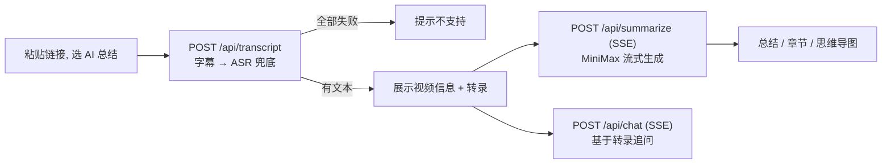

# AI 视频总结功能 - 方案设计文档

> 版本：V1.0
> 创建日期：2026-06-02
> 状态：已确认并实现

---

## 一、背景与目标

在已完成的「万能视频下载器」基础上，新增 **AI 视频总结** 模块，帮助用户在不完整观看长视频的情况下，快速获取视频大纲、核心知识要点，并可基于视频内容追问，提升学习与分析效率。

本方案在竞品调研（NoteGPT、BibiGPT）基础上，结合本项目「无数据库、轻量化」的架构约束裁剪而成。

## 二、竞品调研结论（节选）

| 维度 | NoteGPT | BibiGPT | 本项目取舍 |
|------|---------|---------|-----------|
| 核心流程 | 链接 → 总结/导图/转录 → AI 对话 → 保存工作台 | 链接/本地文件 → 带时间戳总结 + 转写 + 导图 + 知识库 | 链接 → 转录 → 总结/章节/导图/转录 + 追问 |
| 总结 | ✅ | ✅（多模式） | ✅ 结构化总结 |
| 章节时间戳 | ✅ | ✅ | ✅（链接跳转源站） |
| 思维导图 | ✅ | ✅ | ✅（markmap 交互式） |
| 全文转录 | ✅ | ✅（无字幕走 ASR） | ✅（字幕优先，SenseVoice ASR 兜底） |
| AI 追问 | ✅ | ✅（RAG） | ✅（无状态，前端持有上下文） |
| 保存/历史/知识库 | ✅ | ✅ | ❌（保持无数据库） |
| 图文二次创作 | ✅ | ✅ | ❌（后续迭代） |

**保留**：总结、章节时间戳、思维导图、全文转录、AI 追问、导出、**SenseVoice ASR 兜底**。
**裁剪**：保存/历史/知识库、画面视觉理解、图文改写、多端形态（与无数据库/轻量目标冲突或成本过高，列入后续）。

## 三、功能范围

- 大模型：**MiniMax-M2.7**（OpenAI 兼容接口，`base_url=https://api.minimaxi.com/v1`，上下文 20 万 token）
- 文本来源：**优先 yt-dlp 平台字幕**；无字幕或 B 站需登录 CC 时，**本地 SenseVoice ASR**（sherpa-onnx，无需登录）
- 输出：结构化总结、章节（时间戳）、全文转录、思维导图、AI 追问、导出（Markdown / 复制）
- 架构：**无数据库**，结果即用即走；转录文本保存在前端内存，作为追问与导出的上下文

## 四、业务流程

## 五、后端设计

### 5.1 新增模块

| 文件 | 职责 |
|------|------|
| `backend/config.py` | 读取环境变量（MiniMax key / base_url / model / 截断阈值） |
| `backend/.env.example` | 配置样例（真实 `.env` 不入库） |
| `backend/services/transcript_service.py` | yt-dlp 提取字幕，解析 json3 / vtt / srt / B 站 JSON；无字幕时 ASR 兜底 |
| `backend/services/asr_service.py` | SenseVoice（sherpa-onnx）：下载音频 → FFmpeg 16k → 识别 |
| `backend/services/ai_service.py` | MiniMax OpenAI 客户端，`summarize_stream` / `chat_stream`，提示词与 `<think>` 过滤 |

### 5.2 字幕提取（transcript_service）

- yt-dlp `skip_download=True` + `writesubtitles` + `writeautomaticsub`，复用 `video_service._shared_ydl_opts()`
- 语言优先级：中文 > 英文 > 任意；格式优先级：json3 > srv3 > vtt > srt > json
- 解析为 `segments = [{ "t": 秒, "text": "..." }]`，并拼接 `full_text`
- 抖音路径直接抛 `NoSubtitleError`（通常无字幕）
- B 站跳过 danmaku 伪字幕；`need_login_subtitle` 时走 ASR
- ASR：yt-dlp 下载音频 → FFmpeg 转 16kHz mono → SenseVoice（首次运行自动下载 ~200MB 模型）

### 5.3 API 接口

| 方法 | 路径 | 说明 |
|------|------|------|
| POST | `/api/transcript` | 提取字幕，返回视频信息 + `segments` + `full_text`（普通 JSON） |
| POST | `/api/summarize` | SSE 流：`summary` 增量 → `structure`（chapters+mindmap）→ `done` / `error` |
| POST | `/api/chat` | SSE 流：`delta` → `done` / `error`，无状态问答 |
| GET | `/api/ai-status` | 返回 AI 是否已配置 key |

`/api/transcript` 返回码：`0` 成功；`1` 无字幕（友好提示）；`-2` 未配置 key；`-1` 其它错误。

SSE 事件统一序列化为 `event: <name>\ndata: <json>\n\n`，由同步生成器经 StreamingResponse 在线程池中迭代输出。

### 5.4 大模型调用

- 总结：流式 Chat Completion 输出 Markdown（一句话概述 / 核心要点 / 内容详述）
- 结构：独立一次调用，要求只返回 JSON（chapters[start,title,summary] + mindmap markdown），后端做防御式 JSON 解析与时间戳格式化
- 追问：将字幕全文放入 system，附历史轮次，无状态流式回答
- 兼容 MiniMax 推理模型：`extra_body={"reasoning_split": True}` + `<think>` 标签流式剥离

## 六、前端设计

### 6.1 新增文件

| 文件 | 职责 |
|------|------|
| `src/api/summary.js` | `getTranscript` / `streamSummarize` / `streamChat`（fetch + 手写 SSE 解析） |
| `src/composables/useVideoSummary.js` | 管理 transcript / summary / chapters / mindmap / chat 状态 |
| `src/components/ModeTabs.vue` | 「视频下载 / AI 总结」模式切换 |
| `src/components/SummaryPanel.vue` | 结果面板：总结 / 章节 / 转录 / 思维导图 / AI 追问 + 各标签独立复制/导出 |
| `src/components/TabActions.vue` | 标签页底部「复制 / 导出」按钮组 |
| `src/components/MindMap.vue` | markmap 渲染思维导图（滚轮缩放、拖拽平移、PNG 导出） |
| `src/components/ChatBox.vue` | 流式追问对话 |
| `src/components/SummaryIntro.vue` | AI 总结模式的空状态介绍 |

### 6.2 依赖

- `marked`：Markdown 总结渲染
- `markmap-lib` + `markmap-view`：交互式思维导图
- `html-to-image`：思维导图 PNG 导出（Markmap 文字在 SVG `foreignObject` 内，需 DOM 截图而非纯 SVG 转 Canvas）

### 6.3 交互

- 选择「AI 总结」→ 复用 `UrlInput` 输入链接 → 提取字幕成功后自动触发总结（流式）
- 章节 / 转录行的时间戳为超链接，跳转源视频对应时间（B 站 `?t=秒`，YouTube `?t=秒s`）
- **各标签页独立导出：**
  - 总结 / 章节 / 转录 / AI 追问 → Markdown（`.md`）
  - 思维导图 → PNG（`html-to-image` + 导出前内联 `#ffffff` 文字色，与页面展示一致）
- 思维导图：滚轮缩放、拖拽平移、「重置视图」、右上角操作提示

## 七、配置与运行

1. `cd backend && pip install -r requirements.txt`（含 sherpa-onnx、soundfile；需 FFmpeg）
2. 复制 `backend/.env.example` 为 `backend/.env`，填入 `MINIMAX_API_KEY`
3. 启动后端 `uvicorn main:app --reload --port 8000`，前端 `npm run dev`

首次 ASR 会自动下载 SenseVoice 模型到 `backend/models/sensevoice/`。可通过 `ASR_ENABLED=false` 关闭。

未配置 key 时，下载功能不受影响；AI 总结入口会返回「未配置」提示。

## 八、后续可扩展

字幕翻译、图文二次创作、批量总结、引入 SQLite 支持总结历史与会员体系。
