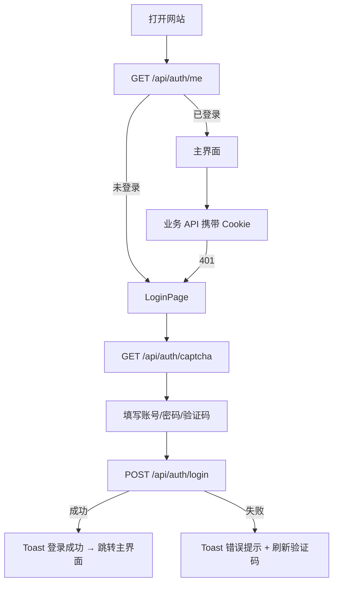

# 登录功能 - 方案设计与实现说明

> 版本：V1.0  
> 更新日期：2026-06-13  
> 状态：已实现

---

## 一、目标

为 SaveAny 增加登录门禁：用户必须输入**正确账号、密码、验证码**后才能访问网站并使用全部功能（视频下载、AI 总结等）。

**设计约束：**

- 仅登录，不含注册、多用户、权限分级
- 不引入数据库，账号来自 `backend/.env`
- 前后端双重拦截（仅隐藏前端页面不够）

---

## 二、技术方案

### 2.1 认证模型

| 项 | 选型 |
|----|------|
| 账号来源 | `.env` 单账号（`AUTH_USERNAME` / `AUTH_PASSWORD`） |
| 会话 | Starlette `SessionMiddleware` + HttpOnly Cookie |
| 验证码 | 纯 Python 生成 SVG Data URL，存 Session，一次性校验 |
| 鉴权 | FastAPI `Depends(require_auth)` 保护业务 API |
| 密码 | 支持明文或 bcrypt 哈希（`passlib[bcrypt]`） |

### 2.2 请求流程



### 2.3 API 一览

| 方法 | 路径 | 鉴权 | 说明 |
|------|------|------|------|
| GET | `/api/auth/captcha` | 否 | 返回 SVG 验证码图片 |
| POST | `/api/auth/login` | 否 | 登录，成功写入 Session |
| GET | `/api/auth/me` | 否 | 返回当前登录状态 |
| POST | `/api/auth/logout` | 否 | 清除 Session |
| GET | `/api/health` | 否 | 健康检查 |
| 其他 `/api/*` | — | 是* | `AUTH_ENABLED=true` 时需有效 Session |

\* `AUTH_ENABLED=false` 时全部跳过鉴权（本地开发）。

### 2.4 登录接口响应码

`POST /api/auth/login` 使用 `{ code, message, data }` 风格：

| code | message | 含义 |
|------|---------|------|
| `0` | 登录成功 | 校验通过 |
| `-1` | 验证码错误 | 验证码不匹配或已过期 |
| `-1` | 账号或密码错误 | 凭证错误 |
| `-1` | 登录尝试过多… | IP 被临时锁定 |

业务 API 未登录时返回 HTTP `401`，body：`{ "detail": "未登录" }`。

---

## 三、后端实现

### 3.1 新增/修改文件

```
backend/
├── config.py                 # AUTH_*、CORS_ORIGINS 环境变量
├── main.py                   # Session 中间件、auth 路由、require_auth 依赖
├── services/auth_service.py  # 验证码、密码校验、登录限流
├── requirements.txt          # +passlib[bcrypt]、+itsdangerous
└── .env.example              # 登录配置模板
```

### 3.2 环境变量

| 变量 | 默认 | 说明 |
|------|------|------|
| `AUTH_ENABLED` | `true` | `false` 跳过登录（本地开发） |
| `AUTH_USERNAME` | — | 登录账号 |
| `AUTH_PASSWORD` | — | 明文或 bcrypt 哈希 |
| `AUTH_SESSION_SECRET` | — | Session 签名密钥，生产必须随机 |
| `AUTH_SESSION_MAX_AGE` | `86400` | 会话有效期（秒） |
| `AUTH_LOGIN_MAX_ATTEMPTS` | `5` | 同 IP 连续失败上限 |
| `AUTH_LOGIN_LOCKOUT_SECONDS` | `300` | 锁定时长（秒） |
| `CORS_ORIGINS` | `http://localhost:5173,...` | 允许跨域来源（含 credentials） |

生成 bcrypt 密码：

```powershell
cd backend
python -c "from passlib.hash import bcrypt; print(bcrypt.hash('你的密码'))"
```

### 3.3 安全要点

- 验证码校验后立即从 Session 清除，防重复使用
- 同 IP 连续失败 5 次锁定 5 分钟（内存计数，单实例部署）
- Cookie：`HttpOnly`、`SameSite=Lax`；生产 HTTPS 时建议 `Secure`
- CORS 不可使用 `allow_origins=["*"]` + `credentials`（已改为显式域名列表）

---

## 四、前端实现

### 4.1 新增文件

```
frontend/src/
├── api/
│   ├── client.js       # 共享 axios（withCredentials + 401 拦截）
│   └── auth.js         # 认证 API（fetch，独立错误提示）
├── composables/
│   ├── useAuth.js      # checkAuth / login / logout
│   ├── authState.js    # 共享登录态（避免循环依赖）
│   └── useToast.js     # 登录提示 Toast
└── components/
    ├── LoginPage.vue   # 登录页
    └── ToastHost.vue   # 登录框内居中 Toast
```

### 4.2 页面逻辑（`App.vue`）

1. 挂载时 `checkAuth()` → `GET /api/auth/me`
2. `authEnabled && !isAuthenticated` → 显示 `LoginPage`
3. 已登录 → 显示主界面（下载 / AI 总结）
4. 业务 API（axios + fetch SSE/下载）均带 `credentials: 'include'`
5. 收到 `401` → 清除登录态，回到登录页

### 4.3 登录页 UI

- 顶部：Logo 与「SaveAny / 万能视频下载器」横向并列
- 表单：账号、密码、验证码（无左侧文字标签，placeholder 提示）
- 验证码图可点击刷新
- 整体登录卡片相对视口垂直居中，并上移 10px

### 4.4 登录提示（Toast）

提示框显示在**登录卡片正中央**，文字使用 SaveAny 渐变色（珊瑚橙 → 琥珀金）：

| 场景 | 提示文案 | 后续行为 |
|------|----------|----------|
| 登录成功 | 登录成功 | 约 0.8s 后跳转主界面 |
| 密码错误 | 账号或密码错误 | 刷新验证码 |
| 验证码错误 | 验证码错误 | 刷新验证码 |

> 渐变色文字需应用在独立 `<span>` 上，不可与 `glass-card` 背景写在同一元素，否则 `background-clip: text` 会导致文字不可见。

### 4.5 主界面 UI 调整（登录相关）

- 导航栏右上角：显示用户名 +「退出」，样式与 SaveAny 一致（`gradient-text`）
- 已移除：GitHub 链接、Hero 区「交互式产品演示」徽章、下载区「支持平台」列表

---

## 五、开发与部署

### 5.1 本地开发

```powershell
# 终端 1 — 后端
cd backend
pip install -r requirements.txt
uvicorn main:app --reload --port 8000

# 终端 2 — 前端
cd frontend
npm run dev
```

本地可设 `AUTH_ENABLED=false` 跳过登录；验收登录功能时改为 `true` 并配置账号。

### 5.2 生产部署要点

- [ ] `AUTH_ENABLED=true`
- [ ] `AUTH_SESSION_SECRET` 随机强密钥
- [ ] `AUTH_PASSWORD` 使用 bcrypt 哈希
- [ ] Nginx 同源托管前端 `dist` + 反代 `/api`
- [ ] HTTPS 开启
- [ ] `CORS_ORIGINS` 设为实际域名

### 5.3 常见问题

| 现象 | 原因 | 处理 |
|------|------|------|
| 验证码加载失败 / 404 | 8000 端口跑的是旧版后端 | 结束旧进程，重启后端 |
| 登录后 API 仍 401 | Cookie 未带上或 Session 密钥变更 | 检查 Vite 代理、`.env` 中 `AUTH_SESSION_SECRET` |
| 提示文字看不见 | 渐变文字写在带背景的容器上 | 已修复：文字单独用 `<span class="toast-text">` |

---

## 六、验收清单

- [ ] 未登录仅见登录页
- [ ] 验证码 / 密码错误 → 居中 Toast 提示，不进入主界面
- [ ] 三项正确 → 「登录成功」Toast → 进入主界面，下载与 AI 总结可用
- [ ] 点击「退出」→ 回登录页；直接请求 `/api/parse` 返回 401
- [ ] `AUTH_ENABLED=false` → 行为与改造前一致

---

## 七、相关文档

| 文档 | 内容 |
|------|------|
| [operations.md](./operations.md) | 日常操作、环境变量、验收步骤 |
| [CLAUDE.md](../CLAUDE.md) | 仓库开发约定（面向 AI/贡献者） |
