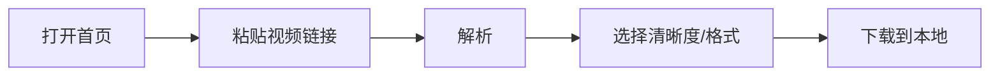
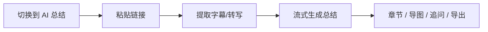

# SaveAny 开发与使用操作指南

> 版本：V1.1  
> 更新日期：2026-06-08  
> 适用对象：本地开发、自托管部署、功能验收

---

## 一、环境要求

| 组件 | 版本 | 用途 |
|------|------|------|
| Python | 3.11+ | 后端 FastAPI |
| Node.js | 18+ | 前端 Vue / Vite |
| FFmpeg | 任意较新版本 | 音视频合并、ASR 转码 |
| pip / npm | 随运行时安装 | 依赖管理 |

**Windows 安装 FFmpeg（推荐）：**

```powershell
winget install Gyan.FFmpeg
```

安装后确认：

```powershell
ffmpeg -version
```

---

## 二、首次安装

### 2.1 克隆仓库

```powershell
cd F:\vibecoding\free-video-download
```

### 2.2 后端

```powershell
cd backend
pip install -r requirements.txt
```

复制环境变量模板并填写 MiniMax 密钥（AI 总结功能需要）：

```powershell
copy .env.example .env
```

编辑 `backend/.env`，至少设置：

```env
MINIMAX_API_KEY=你的密钥
```

密钥获取：https://platform.minimaxi.com

> 未配置 `MINIMAX_API_KEY` 时，**视频下载**仍可用；**AI 总结**会提示未配置。

### 2.3 前端

```powershell
cd ..\frontend
npm install
```

---

## 三、日常启动（开发模式）

需要**两个终端**，分别启动后端与前端。

### 终端 1 — 后端

```powershell
cd backend
uvicorn main:app --reload --port 8000
```

成功标志：

```
INFO:     Uvicorn running on http://127.0.0.1:8000
INFO:     Application startup complete.
```

### 终端 2 — 前端

```powershell
cd frontend
npm run dev
```

成功标志：

```
➜  Local:   http://localhost:5173/
```

若 5173 被占用，Vite 会自动改用 **5174** 等端口，以终端输出为准。

### 访问地址

| 服务 | 地址 |
|------|------|
| 前端页面 | http://localhost:5173/ |
| 后端 API | http://127.0.0.1:8000 |
| Swagger 文档 | http://127.0.0.1:8000/docs |
| 健康检查 | http://127.0.0.1:8000/api/health |
| AI 配置状态 | http://127.0.0.1:8000/api/ai-status |

开发模式下，前端通过 Vite 代理将 `/api/*` 转发到 `http://localhost:8000`（见 `frontend/vite.config.js`）。

---

## 四、功能操作流程

### 4.1 视频下载



1. 浏览器打开前端地址。
2. 保持默认 **「视频下载」** 模式。
3. 粘贴支持平台的视频 URL（B 站、YouTube、抖音等）。
4. 点击解析，等待返回标题、封面、格式列表。
5. 选择目标格式，点击下载；文件通过浏览器保存到本地。

**说明：** 下载文件在服务端为临时文件，传输完成后自动清理。

### 4.2 AI 视频总结



1. 顶部切换到 **「AI 总结」**。
2. 粘贴视频链接并提交。
3. 等待字幕提取（界面显示「字幕/语音识别中…」）。
4. 成功后自动触发 AI 总结（流式输出）。
5. 可切换：**总结**、**章节**、**转录**、**思维导图**、**AI 追问**。
6. 各标签页独立 **复制 / 导出**：
   - 总结、章节、转录、AI 追问 → 导出 Markdown（`.md`）
   - 思维导图 → **导出 PNG**（2x 分辨率，深色背景 `#0B0B0F`，白色节点文字）

**思维导图交互：** 滚轮缩放、拖拽平移；右上角「重置视图」恢复默认布局。

**前置条件：** `backend/.env` 中已配置有效的 `MINIMAX_API_KEY`。

---

## 五、B 站字幕获取策略（重要）

AI 总结依赖字幕文本。B 站按以下**优先级**获取，无需用户登录 B 站：

| 顺序 | 方式 | 说明 |
|------|------|------|
| 1 | yt-dlp 平台字幕 | 通用，多平台共用 |
| 2 | B 站 `dm/view` 公开接口 | 无 Cookie，官方 CC / AI 字幕 |
| 3 | SenseVoice 本地 ASR | 仅当前两步均无字幕时启用 |

**第 2 步技术链路：**

```
BV → /x/web-interface/view（aid、cid）
   → /x/v2/dm/view?type=1&oid=cid&pid=aid
   → subtitle_url JSON（body[].from / content）
```

成功时前端展示 **「B站官方字幕」**；走 ASR 时展示 **「语音识别（SenseVoice）」**。

**B 站 HTTP 412 说明：** B 站 API 现要求请求头携带 `Origin: https://www.bilibili.com`。后端已在 `video_service.py` 与 `transcript_service.py` 中统一添加，无需用户配置。

**ASR 首次使用：** 自动下载约 200MB 模型到 `backend/models/sensevoice/`，需联网，耗时 1～3 分钟。

---

## 六、环境变量参考

文件路径：`backend/.env`（勿提交 Git）

| 变量 | 必填 | 说明 |
|------|------|------|
| `MINIMAX_API_KEY` | AI 总结必填 | MiniMax API 密钥 |
| `MINIMAX_BASE_URL` | 否 | 默认 `https://api.minimaxi.com/v1` |
| `MINIMAX_MODEL` | 否 | 默认 `MiniMax-M2.7` |
| `ASR_ENABLED` | 否 | 默认 `true`，关闭则无 ASR 兜底 |
| `SENSEVOICE_USE_INT8` | 否 | 默认 `true`，使用 int8 模型 |
| `ASR_MAX_DURATION_SECONDS` | 否 | 默认 `1800`，超长视频跳过 ASR |
| `YTDLP_COOKIE_FILE` | 否 | yt-dlp Netscape Cookie 文件（可选） |

完整模板见 `backend/.env.example`。

---

## 七、生产构建（可选）

```powershell
# 前端静态资源
cd frontend
npm run build
# 产出目录：frontend/dist/

# 后端生产启动（示例）
cd ..\backend
uvicorn main:app --host 0.0.0.0 --port 8000
```

生产环境需自行配置反向代理、HTTPS，并将前端 `dist` 或由 Nginx 托管。

---

## 八、常见问题

### 8.1 端口被占用

**现象：** `Port 5173 is in use` 或后端启动后立即退出。

**处理：**

```powershell
netstat -ano | findstr ":8000"
netstat -ano | findstr ":5173"
```

结束占用进程（将 `<PID>` 替换为实际进程号）：

```powershell
taskkill /PID <PID> /F
```

然后重新启动前后端。

### 8.2 AI 总结提示「未配置 MiniMax API Key」

- 确认密钥写在 **`backend/.env`**，而非 `.env.example`。
- 修改 `.env` 后**重启后端**。
- 访问 http://127.0.0.1:8000/api/ai-status 查看 `configured` 与 `hint`。

### 8.3 B 站总结很慢

- 若标签为 **「语音识别（SenseVoice）」**：正在下载音频并本地识别，长视频较慢。
- 若标签为 **「B站官方字幕」**：应为秒级；若异常慢，检查网络或后端日志。

### 8.4 字幕提取失败

| 情况 | 建议 |
|------|------|
| 抖音链接 | 通常无字幕，暂不支持 AI 总结 |
| 无 CC 且未装 ASR 依赖 | `pip install sherpa-onnx soundfile` |
| ASR 报错 | 确认 FFmpeg 可用；视频时长是否超过 `ASR_MAX_DURATION_SECONDS` |

### 8.5 下载只有单流、无法合并高清

- 安装 FFmpeg 并确保在 `PATH` 中；后端会通过 `imageio-ffmpeg` 尝试兜底。

### 8.6 思维导图 PNG 导出失败或文字颜色不对

| 情况 | 建议 |
|------|------|
| Vite 报 `Failed to resolve import "html-to-image"` | 在 `frontend/` 执行 `npm install` 后**重启** dev server |
| 点击导出无反应 | 确认已生成思维导图；导出前会自动切到「思维导图」标签 |
| PNG 文字为黑色而非白色 | 已修复：导出前内联白色文字样式；更新代码后刷新页面重试 |
| 导出空白图 | Markmap 使用 SVG `foreignObject` 渲染文字，不能用纯 SVG→Canvas；需依赖 `html-to-image` |

---

## 九、API 速查

| 方法 | 路径 | 说明 |
|------|------|------|
| POST | `/api/parse` | 解析视频元数据 |
| GET | `/api/download` | 流式下载 |
| POST | `/api/transcript` | 提取字幕（AI 总结） |
| POST | `/api/summarize` | SSE 流式总结 |
| POST | `/api/chat` | SSE 追问 |
| GET | `/api/ai-status` | AI / ASR 配置状态 |
| GET | `/api/platforms` | 支持平台列表 |
| GET | `/api/health` | 健康检查 |
| GET | `/api/auth/captcha` | 获取登录验证码（SVG） |
| POST | `/api/auth/login` | 登录（账号+密码+验证码） |
| GET | `/api/auth/me` | 当前登录状态 |
| POST | `/api/auth/logout` | 退出登录 |

**登录保护：** 当 `AUTH_ENABLED=true` 时，除上述 auth 接口与 `/api/health` 外，所有 `/api/*` 均需有效 Session Cookie。

---

## 十二、登录配置与验收

### 12.1 环境变量

在 `backend/.env` 中配置（模板见 `.env.example`）：

| 变量 | 说明 |
|------|------|
| `AUTH_ENABLED` | `true` 开启登录门禁；本地开发可设 `false` 跳过 |
| `AUTH_USERNAME` | 登录账号 |
| `AUTH_PASSWORD` | 明文或 bcrypt 哈希（推荐生产用哈希） |
| `AUTH_SESSION_SECRET` | Session 签名密钥，生产必须随机生成 |

生成 bcrypt 密码哈希：

```powershell
cd backend
python -c "from passlib.hash import bcrypt; print(bcrypt.hash('你的密码'))"
```

### 12.2 登录页与提示行为

| 场景 | 提示文案 | 行为 |
|------|----------|------|
| 登录成功 | 登录成功 | Toast 显示于登录框中央，约 0.8s 后进入主界面 |
| 密码错误 | 账号或密码错误 | Toast + 自动刷新验证码 |
| 验证码错误 | 验证码错误 | Toast + 自动刷新验证码 |

主界面导航栏右上角显示用户名与「退出」，字体样式与 SaveAny 渐变色一致。已移除 GitHub 链接、Hero「交互式产品演示」徽章、下载区「支持平台」列表。

完整方案见 [auth-login-design.md](./auth-login-design.md)。

### 12.3 验收步骤

1. `AUTH_ENABLED=true`，配置账号密码，重启后端。
2. 打开前端 → 应显示登录页。
3. 错误验证码 / 错误密码 → 提示错误，不进入主界面。
4. 正确登录 → 下载与 AI 总结功能正常。
5. 点击「退出」→ 回到登录页；直接请求 `/api/parse` 返回 401。

---

## 十三、相关文档

| 文档 | 内容 |
|------|------|
| [requirements.md](./requirements.md) | 产品需求 |
| [design.md](./design.md) | 架构设计 |
| [ai-summary-design.md](./ai-summary-design.md) | AI 总结方案 |
| [auth-login-design.md](./auth-login-design.md) | 登录功能方案与实现 |
| [CLAUDE.md](../CLAUDE.md) | 仓库开发约定（面向 AI/贡献者） |

---

## 十一、推荐验收用例

| 场景 | 链接示例 | 预期 |
|------|----------|------|
| B 站官方 AI 字幕 | `BV1ntVm6qEu4` | `B站官方字幕`，百句级分段 |
| B 站人工字幕 | `BV1GJ411x7h7` | `B站官方字幕` |
| 无字幕走 ASR | 无 CC 的老视频 | `语音识别（SenseVoice）` |
| 下载 | 任意支持平台 URL | 浏览器保存文件 |
